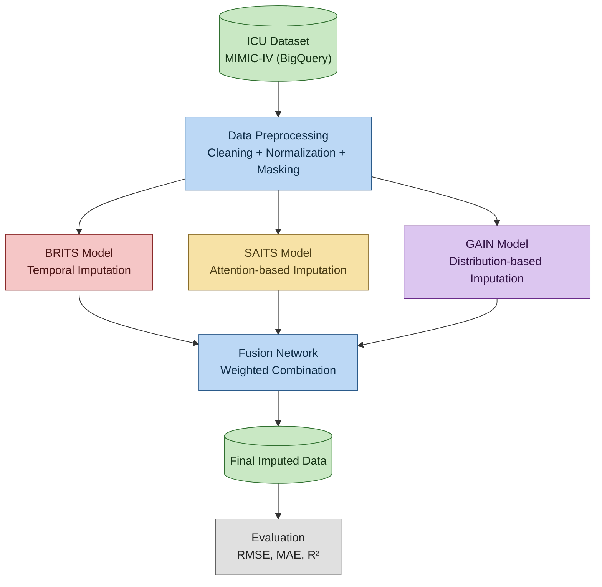
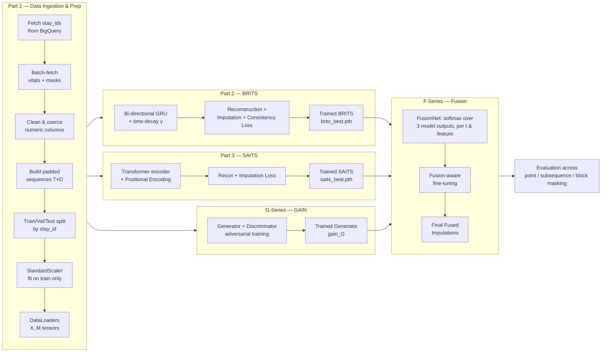
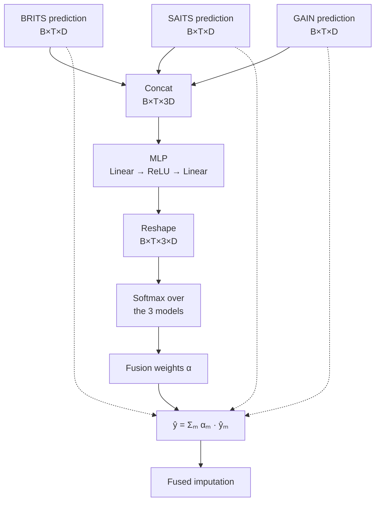
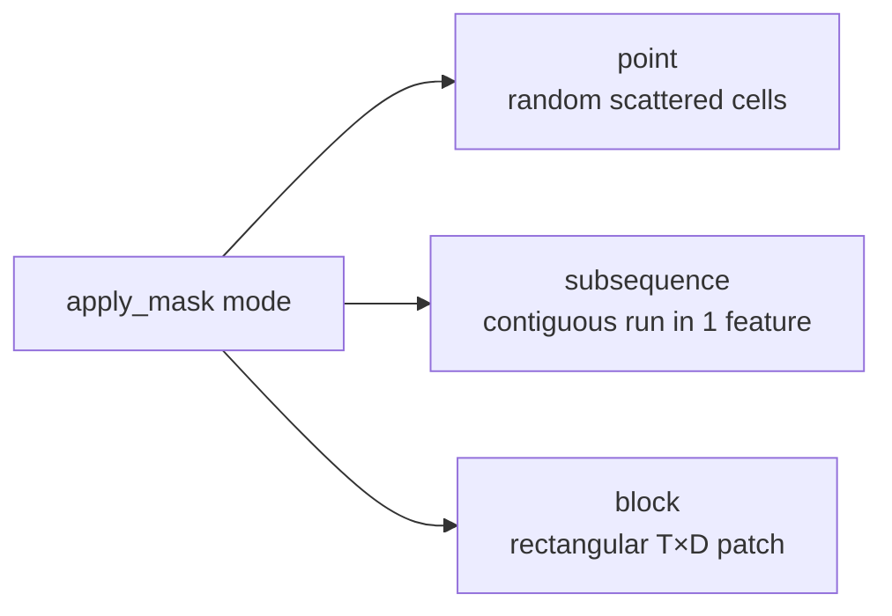
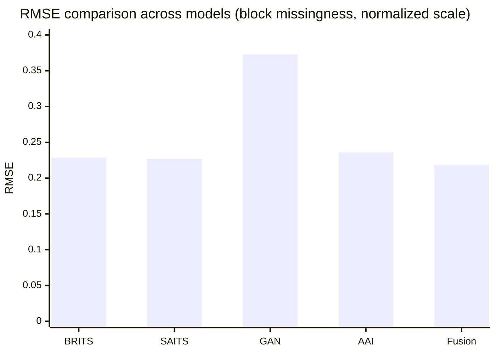

# MedImpute-X
# 🏥 MedImputeX

**A Hybrid Generative & Explainable Framework for Missing Data Imputation in Healthcare Time-Series**

[](https://www.python.org/)
[](https://pytorch.org/)
[](https://mimic.mit.edu/)
[]()
[]()


## 📋 Abstract

MedImputeX is a **multi-model fusion framework** for imputing missing values in ICU multivariate time-series data. It integrates three complementary imputation paradigms — **BRITS** (temporal/recurrent), **SAITS** (attention-based), and **GAIN** (adversarial/generative) — through a learned, per-time-step, per-feature **adaptive fusion network**. An **Alternating Attention Imputer (AAI)** is also implemented as a strong single-model baseline. Evaluated on real ICU data pulled from **MIMIC-IV** via BigQuery, the fusion model consistently outperforms every individual baseline across **point**, **subsequence**, and **block** missingness patterns.

---

## ⚠️ Problem Statement

- ICU datasets contain **60–90% missing values** due to irregular sampling and sensor failures.
- Traditional methods (mean fill, forward-fill) fail to capture complex temporal dependencies.
- Single-model architectures cannot handle **diverse missing patterns** (point, subsequence, block) simultaneously.
- Missing data severely impacts ML model reliability and **patient safety** in downstream clinical decisions.

## 🎯 Objectives

1. Design a multi-model fusion framework integrating **BRITS + SAITS + GAIN**.
2. Capture temporal dependencies, long-range relationships, and value distributions jointly.
3. Handle all missing patterns — **point, subsequence, and block** missingness.
4. Provide **explainability** (attention maps / feature-wise contribution) for transparent clinical decision support.
5. Improve downstream prediction accuracy on the real-world **MIMIC-IV** dataset.

---

## 🗄️ Dataset — MIMIC-IV

Real-world ICU patient data retrieved through a custom SQL/BigQuery pipeline (`medimpute-x.mimic_subset.hourly_features_final`).

| Attribute | Detail |
|---|---|
| **Cohort** | Adult ICU patients (age ≥ 18), first ICU stay per patient |
| **Granularity** | Hourly aggregation, long → wide pivot for time-series alignment |
| **Numeric features (D=13)** | `hr, rr, spo2, temp, sbp, dbp, map, creatinine, lactate, glucose, sodium, potassium, wbc` |
| **Mask features** | One binary `<feature>_mask` column per numeric feature |
| **Meta features** | `subject_id, stay_id, hour, anchor_age, gender, hospital_expire_flag` |
| **Sequence length (T)** | 48 hours (padded/truncated per stay) |
| **Sample size used** | 2,000 randomly sampled stays (out of 65,354 available), fetched in 200-stay batches to avoid OOM |
| **Split** | Train 1,400 stays / Val 200 stays / Test 400 stays (split by `stay_id`, seed = 42) |

---

## ⚙️ System Architecture — Pipeline



### End-to-end data flow (notebook structure)



---

## 🔬 Methodology

| Component | Role | Key idea |
|---|---|---|
| **BRITS** | Temporal imputation | Bidirectional RNN (forward + backward GRU cells) with a learned time-decay `γ = exp(-ReLU(Wδ))` that decays hidden state influence as time-since-last-observation grows. Captures local temporal trends in vitals (HR, MAP, RR). |
| **SAITS** | Attention-based imputation | Transformer encoder (value + mask embeddings + sinusoidal positional encoding) with self-attention blocks. Models long-range inter-variable correlations. |
| **GAIN** | Generative imputation | Generator/Discriminator adversarial pair; generator produces raw imputations blended with observed values, discriminator predicts the observation mask. Ensures distribution-level realism. |
| **Fusion Network** | Adaptive combination | A small MLP takes the concatenated predictions of all 3 models per `(t, feature)` and outputs a **softmax weight per model**, forming a convex combination `ŷ = Σ αₘ · ŷₘ`. Trained with an entropy regularizer to discourage collapsing onto a single model. |
| **AAI (Alternating Attention Imputer)** | Strong single-model baseline | Alternates **temporal attention** (over time) and **variable attention** (global feature context per time-step) blocks — used to benchmark the fusion network against a competitive standalone architecture. |
| **XAI** | Interpretability | Per-model attention heatmaps (SAITS/AAI) and per-feature fusion-weight bar charts showing which model dominates for each vital sign. |

### Fusion network — how weights are computed



### Missingness patterns simulated for training/evaluation



---

## 🧠 Model Training Configuration

| Model | Epochs | LR | Hidden/Model dim | Notes |
|---|---|---|---|---|
| BRITS | 30 | 1e-3 | 128 | `α_impute=2.0`, `β_consistency=0.5`, grad clip 5.0 |
| SAITS | 30 | 1e-3 | d_model=128, 4 heads, 2 layers, d_ff=256 | `α_impute=2.0`, weight decay 1e-5 |
| GAIN | 40 | 1e-4 | hidden=256 | `λ_mse=10.0`, grad clip 5.0 on G & D |
| Fusion | 20 (+ 8 fine-tune) | 1e-3 (fine-tune 5e-5) | hidden=128 | Entropy coef 0.01; fine-tuning unfreezes BRITS `fc` + SAITS `out` heads jointly with fusion |
| AAI (baseline) | 30 | 1e-3 | d_model=128, 4 heads, 2 layers | Same loss recipe as SAITS for fair comparison |

Reproducibility: global `SEED = 42` fixed across Python, NumPy, PyTorch (CPU/CUDA), and `cudnn.deterministic = True`.

---

## 📊 Experimental Results (MIMIC-IV, artificial-hidden test positions)

### Headline metrics (Fusion, block missingness)

| RMSE | MAE | R² | Coverage |
|---|---|---|---|
| **0.5172** | **0.3306** | **0.4929** | 88–92% |

### Full comparison across missingness types

| Missing Type | Model | RMSE | MAE | R² |
|---|---|---|---|---|
| Point | AAI Baseline | 0.6177 | 0.3355 | 0.4060 |
| Point | **Fusion (Ours)** | **0.5946** | **0.3130** | **0.4495** |
| Subsequence | AAI Baseline | 0.6410 | 0.4621 | 0.3596 |
| Subsequence | **Fusion (Ours)** | **0.6075** | **0.4303** | **0.4248** |
| Block | AAI Baseline | 0.5690 | 0.3679 | 0.3862 |
| Block | **Fusion (Ours)** | **0.5172** | **0.3306** | **0.4929** |

### Normalized-scale single-model comparison (test set, block masking)

| Model | RMSE | MAE | R² |
|---|---|---|---|
| BRITS | 0.2285 | 0.1100 | 0.6039 |
| SAITS | 0.2270 | 0.1014 | 0.6090 |
| GAN (GAIN) | 0.3726 | 0.1840 | −0.0531 |
| AAI | 0.2359 | 0.1059 | 0.5781 |
| **Fusion** | **0.2189** | **0.0993** | **0.6367** |

> Fusion improves RMSE by **~3.6%** over the best single model (SAITS) on the normalized scale.



---

## 📈 Explainability (XAI)

- **Per-feature fusion weights**: bar charts show, e.g., GAIN dominating electrolyte features (map, creatinine, lactate, sodium, potassium), SAITS dominating vitals with strong temporal/attention patterns (hr, spo2, temp, dbp, creatinine), and BRITS contributing on rr/sbp/glucose/wbc.
- **Attention heatmaps**: SAITS/AAI self-attention matrices (T×T) reveal which time steps most influence each imputed value.
- **Error heatmaps**: average absolute error plotted over (time index × feature) to identify where each model struggles.

---

## 🏥 Applications

- **Clinical Decision Support** — reliable ICU vitals for early deterioration detection.
- **Predictive Analytics** — improved downstream mortality & sepsis-risk modeling.
- **Healthcare AI** — reusable preprocessing backbone for EHR deep-learning pipelines.

---


## 🚀 Getting Started

```bash
# clone the repository
git clone https://github.com/<your-org>/MedImputeX.git
cd MedImputeX

# install dependencies
pip install pandas_gbq google-cloud-bigquery torch torchvision torchaudio \
            matplotlib seaborn scikit-learn tqdm

# authenticate against your BigQuery project (Colab / GCP)
# then run notebooks/major_project_MedImputeX_FINAL.ipynb top to bottom:
#   Part 1  -> data ingestion, cleaning, scaling, DataLoaders
#   Part 2  -> BRITS training + evaluation
#   Part 3  -> SAITS training + evaluation
#   G-Series -> GAIN training + evaluation
#   F-Series -> Fusion network training + fine-tuning + comparison
#   AAI      -> Alternating Attention baseline + AAI vs Fusion comparison
```

**Note:** the BigQuery table reference (`medimpute-x.mimic_subset.hourly_features_final`) and `PROJECT_ID` must be replaced with your own MIMIC-IV BigQuery project/table before running the data-ingestion cells.


## ⚖️ Notes & Limitations

- Trained on a **2,000-stay random subsample** of MIMIC-IV for prototyping; results may shift with the full cohort.
- GAIN underperforms as a standalone imputer (negative R² in some settings) but still contributes useful signal to the fusion in specific feature/time regions.
- Metrics are computed on **artificially hidden** (masked-out) observed values, a standard proxy for true missing-data imputation quality.
- MIMIC-IV access requires a completed PhysioNet credentialing process and a data use agreement.
